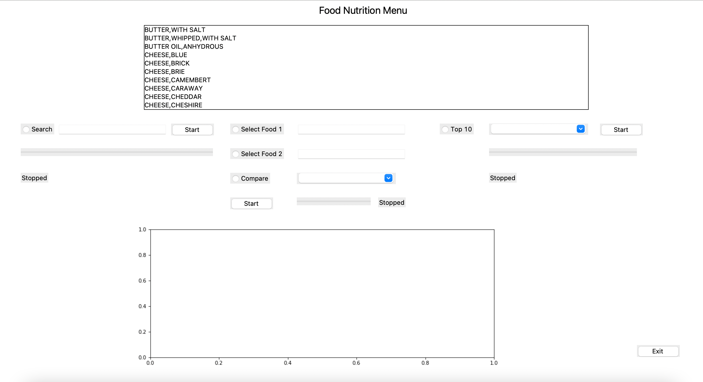

## Description What the application does.Consider including a screen-shot and a link to your demonstration video.

In this project, an application that collects more than 40,000 food items, users can see how many nutrients each food has. 
Users can compare foods, which can choose the type of nutrients to compare, and users can browse for each nutrient.
Which food has the most of this nutrient? ranked in the top 10.

## Running the Application.Any dependencies (packages) needed to run your program. How to run it.
I used `pandas` packages to open file csv and process data.
I used `tkinter` and `Python` to develop a standalone GUI application.
I used `matplotlib` to plot the graph that show in the application.

## Design
Describe the overall design, including a UML class diagram.

 
## Design Patterns Used.Describe any design patterns you used, and how they are used in your application.
I used design patterns in `nutrition.py`. I used `Factory Method` is a `Creational Design Pattern` 
that allows an interface or a class to create an object, 
but lets subclasses decide which class or object to instantiate. Using the Factory method, 
we have the best ways to create an object. Here, objects are created without exposing the logic to the client, 
and for creating the new type of object, the client uses the same common interface.
 
## Other Information
The menu will show as the listbox and the users can select the menu.
